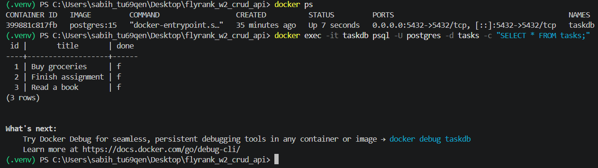

# Task API

A simple CRUD API built with FastAPI for managing tasks.

## How to Run

Install the required dependencies:

pip install fastapi uvicorn sqlalchemy

Start the API:

uvicorn main:app --reload

The API will run at:

http://127.0.0.1:8000

## API Endpoints

| Method | Endpoint | Description |
|---|---|---|
| GET | /tasks | Get all tasks |
| POST | /tasks | Create a new task |
| PUT | /tasks/{task_id} | Update a task |
| DELETE | /tasks/{task_id} | Delete a task |
| GET | /tasks/{task_id} | Get a single task |

## Swagger Documentation

Open:

http://127.0.0.1:8000/docs

## Testing

CRUD endpoints were tested using FastAPI Swagger UI.

## Project Structure

- main.py — FastAPI application and CRUD endpoints
- database.py — SQLite database configuration and Task database model
- .gitignore — Files and folders excluded from Git
- README.md — Project documentation

## API Testing Evidence

### Swagger UI


### curl -i Test


## SQLite Database

Tasks are stored in a SQLite database (`tasks.db`), so task data persists even after the server restarts.

The database file is created automatically when the API starts.

The project uses SQLite because it is lightweight, simple to set up, and suitable for a small CRUD API.

The local database file `tasks.db` is ignored by Git so that each clone can create its own local database.

Example SQLite query:

```sql
SELECT * FROM tasks;
Database Testing

The following SQL queries were used to inspect and test the database:

SELECT id, title, done FROM tasks;
UPDATE tasks SET done = 1;
DELETE FROM tasks WHERE done = 1;

Database changes were verified through the FastAPI API after the SQL operations.

Database Persistence

The SQLite database provides persistent storage for tasks.

Task data remains available after stopping and restarting the FastAPI server because the data is stored in tasks.db rather than only in memory.
## API Testing Evidence

### Swagger UI


### curl -i Test


## SQLite Database

Tasks are stored in a SQLite database (`tasks.db`), so task data persists even after the server restarts.

The database file is created automatically when the API starts.

Example SQLite query:

```sql
SELECT * FROM tasks;

# Task API — Containerized with PostgreSQL

A simple CRUD Task API built with FastAPI, running with PostgreSQL in Docker.

---

## 🚀 One Command to Run Everything

```bash
docker-compose up --build

### Environment Setup

Copy `.env.example` to `.env`:

cp .env.example .env

### Test with Swagger UI

http://localhost:8000/docs

### API Endpoints

| Method | Endpoint | Description |
|--------|----------|-------------|
| GET | /tasks | Get all tasks |
| GET | /tasks/{id} | Get a single task |
| POST | /tasks | Create a new task |
| PUT | /tasks/{id} | Update a task |
| DELETE | /tasks/{id} | Delete a task |

### Tech Stack

- Python + FastAPI
- PostgreSQL (in Docker)
- SQLAlchemy ORM
- Docker Compose

### Database Screenshot



### Evidence
All endpoints were tested using:

 Swagger UI

 curl commands

 PostgreSQL database verification

## 🤖 AI vs Me

### My Prompt
Containerize my FastAPI CRUD task API with PostgreSQL using Docker Compose. Use Python with FastAPI, SQLAlchemy, and psycopg2-binary. The app should connect to PostgreSQL using DATABASE_URL from .env. Create tasks table with id, title, done columns and seed 3 example tasks only if empty. All 5 endpoints should work (GET, POST, PUT, DELETE). Use parameterized queries. Password from .env, never hardcoded. Use a volume for database persistence. Start everything with docker-compose up --build.

### What AI did better:
1. **Healthcheck added**: AI added `healthcheck` with `pg_isready` to ensure Postgres is ready before app starts
2. **Retry logic**: AI added `wait_for_db_and_create_tables()` function for extra safety
3. **Better restart policy**: AI used `restart: always` instead of `unless-stopped`

### What AI got wrong:
1. **Used SQLAlchemy ORM instead of raw SQL**: AI used ORM queries instead of raw parameterized queries
2. **No explicit volume name**: AI used `pgdata` instead of `taskdata` (less descriptive)
3. **Used `version: "3.9"`**: This is deprecated in newer Docker Compose versions

### What I learned:
- Healthcheck is important for container startup order
- Docker networking: `db` service name is used instead of `localhost` because containers are on the same network
- AI is good at adding safety features like healthchecks and retry logic
- Always specify `depends_on` with `condition: service_healthy` for production
